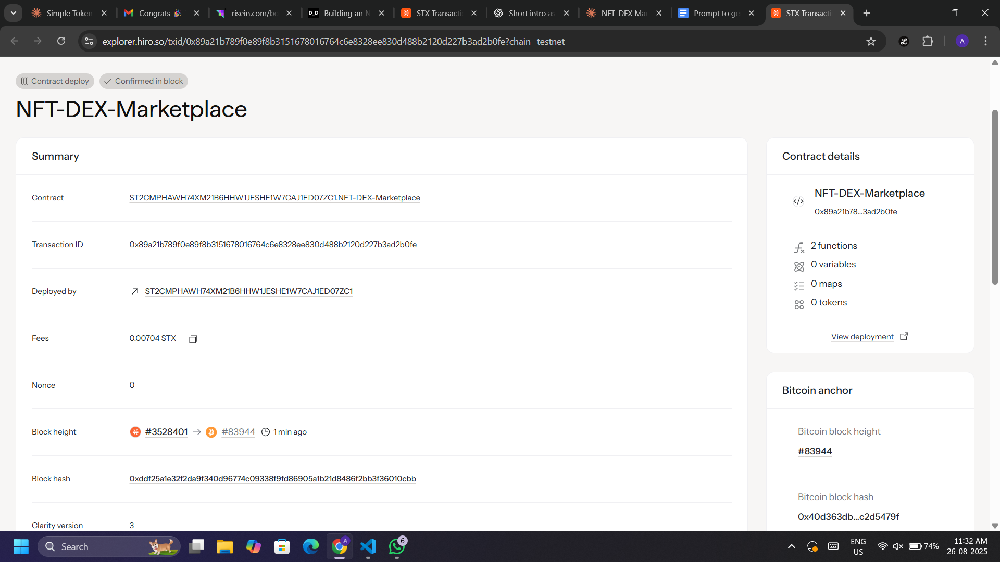

# NFT-DEX Marketplace

## Project Title
**NFT-DEX Marketplace** - A Specialized Decentralized Exchange for Non-Fungible Tokens

## Project Description

The NFT-DEX Marketplace is an innovative decentralized exchange built on the Stacks blockchain using Clarity smart contracts. This specialized platform revolutionizes NFT trading by introducing advanced features such as:

- **Fractional Ownership**: Break down expensive NFTs into smaller, tradeable shares, making high-value digital assets accessible to a broader range of investors
- **Liquidity Pools**: Integrate liquidity pool mechanisms for better price discovery and reduced slippage in NFT transactions
- **Escrow System**: Secure smart contract-based escrow that holds NFTs during the listing period, ensuring trust and security
- **Multi-Collection Support**: Compatible with various NFT collections through trait-based architecture
- **Fee Distribution**: Platform sustainability through configurable fee structures that support liquidity provision

The marketplace addresses key challenges in the current NFT ecosystem:
- **Liquidity Issues**: Traditional NFT markets suffer from low liquidity and high price volatility
- **Accessibility Barriers**: High-value NFTs are inaccessible to smaller investors
- **Price Discovery**: Limited mechanisms for efficient price discovery in illiquid markets
- **Security Concerns**: Centralized platforms pose custody and counterparty risks

## Project Vision

Our vision is to create the most liquid, accessible, and secure NFT trading environment on the Stacks ecosystem. We aim to:

1. **Democratize NFT Ownership**: Enable fractional ownership to make premium NFTs accessible to everyone, regardless of capital size

2. **Enhance Market Efficiency**: Implement liquidity pool mechanisms that provide continuous liquidity and fair price discovery for NFT assets

3. **Build Trust Through Transparency**: Utilize blockchain technology and smart contracts to create a transparent, trustless trading environment where users maintain full control of their assets

4. **Foster Innovation**: Serve as a foundation for advanced DeFi-NFT hybrid products, including NFT-collateralized lending, yield farming with NFT rewards, and cross-chain NFT trading

5. **Create Sustainable Economics**: Develop a self-sustaining ecosystem where platform fees support liquidity providers and drive continuous platform improvement

## Future Scope

### Phase 1 - Core Expansion (Q2-Q3 2025)
- **Advanced Order Types**: Implement limit orders, dutch auctions, and time-based listings
- **Enhanced Fractional Features**: Add voting mechanisms for fractional owners and dividend distribution
- **Cross-Collection Analytics**: Comprehensive price tracking and market analytics dashboard
- **Mobile Integration**: Mobile-responsive interface and potential native mobile app

### Phase 2 - DeFi Integration (Q4 2025-Q1 2026)
- **NFT-Collateralized Lending**: Use NFTs as collateral for STX or other token loans
- **Yield Farming**: Stake LP tokens from NFT trades to earn additional rewards
- **Insurance Protocol**: Optional insurance for high-value NFT transactions
- **DAO Governance**: Community governance for platform parameters and development decisions

### Phase 3 - Advanced Features (Q2-Q4 2026)
- **Cross-Chain Bridge**: Enable trading of NFTs from other blockchains (Ethereum, Polygon, Solana)
- **AI-Powered Valuation**: Machine learning algorithms for dynamic NFT pricing and market predictions
- **Social Trading**: Follow successful NFT traders and copy their strategies
- **Virtual Galleries**: 3D virtual spaces for showcasing and trading NFT collections

### Phase 4 - Enterprise Solutions (2027+)
- **Institutional Tools**: Advanced portfolio management and institutional-grade custody solutions
- **API Marketplace**: Comprehensive APIs for third-party developers and applications
- **White-Label Solutions**: Customizable marketplace solutions for other projects
- **Regulatory Compliance Tools**: Enhanced KYC/AML features for regulated markets

### Long-Term Innovation Areas
- **Metaverse Integration**: Native integration with virtual worlds and metaverse platforms
- **Carbon-Neutral Trading**: Environmental sustainability initiatives and carbon offset programs
- **Advanced Derivatives**: Options and futures contracts for NFT collections
- **Interoperability Standards**: Leadership in developing cross-chain NFT standards

## Technical Roadmap
- **Smart Contract Audits**: Professional security audits for all contract upgrades
- **Scalability Solutions**: Layer 2 integration for reduced transaction costs
- **Oracle Integration**: Real-world data feeds for enhanced price discovery
- **Formal Verification**: Mathematical proofs for critical contract functions

## Contract Address Details

*Contract addresses will be updated once deployed to mainnet and testnet*

### Mainnet Deployment
- **Contract Address**: `[To be added after deployment]`
- **Transaction ID**: `[To be added after deployment]`
- **Block Height**: `[To be added after deployment]`

### Testnet Deployment
- **Contract Address**: `[To be added after deployment]`
- **Transaction ID**: `[To be added after deployment]`
- **Block Height**: `[To be added after deployment]`

### Contract Verification
- **Source Code**: Verified and publicly available on this repository
- **Compiler Version**: Clarity VM Latest
- **Audit Status**: `[To be updated after audit completion]`

---

## Installation & Setup

### Prerequisites
- [Clarinet](https://github.com/hirosystems/clarinet) - Stacks smart contract development tool
- [Stacks Wallet](https://wallet.hiro.so/) (Hiro Wallet recommended)
- STX tokens for transaction fees
- Compatible NFT collection for testing

### Local Development Setup

1. **Clone the repository**:
   ```bash
   git clone https://github.com/yourusername/nft-dex-marketplace.git
   cd nft-dex-marketplace
   ```

2. **Initialize Clarinet project** (if not already done):
   ```bash
   clarinet new nft-dex-marketplace
   cd nft-dex-marketplace
   ```

3. **Add the contract to your Clarinet.toml**:
   ```toml
   [contracts.nft-dex-marketplace]
   path = "contracts/nft-dex-marketplace.clar"
   depends_on = []
   ```

4. **Test the contract**:
   ```bash
   clarinet test
   ```

5. **Check contract syntax**:
   ```bash
   clarinet check
   ```

### Contract Usage

#### Core Functions

1. **List an NFT**:
   ```clarity
   (contract-call? .nft-dex-marketplace create-nft-listing 
     nft-contract 
     token-id 
     price-in-ustx 
     enable-fractional 
     total-shares)
   ```

2. **Execute Trade** (for fractional purchases):
   ```clarity
   (contract-call? .nft-dex-marketplace execute-trade 
     listing-id 
     shares-to-buy)
   ```

3. **Complete NFT Transfer** (for full NFT purchases):
   ```clarity
   ;; Step 1: Execute trade
   (contract-call? .nft-dex-marketplace execute-trade listing-id u1)
   
   ;; Step 2: Complete NFT transfer
   (contract-call? .nft-dex-marketplace complete-nft-transfer 
     nft-contract 
     listing-id 
     buyer-principal)
   ```

#### Read-Only Functions

- **Get listing details**:
  ```clarity
  (contract-call? .nft-dex-marketplace get-listing listing-id)
  ```

- **Check fractional ownership**:
  ```clarity
  (contract-call? .nft-dex-marketplace get-fractional-ownership listing-id owner)
  ```

- **View liquidity pool stats**:
  ```clarity
  (contract-call? .nft-dex-marketplace get-liquidity-pool nft-contract-address)
  ```

### Example Transaction Flow

#### Listing an NFT for Fractional Sale
```clarity
;; List NFT with 100 fractional shares at 1000 STX total
(contract-call? .nft-dex-marketplace create-nft-listing 
  'ST1234567890.my-nft-contract
  u42  ;; token-id
  u1000000000  ;; 1000 STX in microSTX
  true  ;; enable fractional
  u100)  ;; 100 total shares
```

#### Buying Fractional Shares
```clarity
;; Buy 10 shares (10% of the NFT)
(contract-call? .nft-dex-marketplace execute-trade 
  u1  ;; listing-id
  u10)  ;; shares to buy
```

#### Buying Full NFT
```clarity
;; Step 1: Execute trade for full NFT
(contract-call? .nft-dex-marketplace execute-trade 
  u2  ;; listing-id
  u1)  ;; buy 1 share (full NFT)

;; Step 2: Complete the NFT transfer
(contract-call? .nft-dex-marketplace complete-nft-transfer 
  'ST1234567890.my-nft-contract
  u2  ;; listing-id
  'ST9876543210BUYER)  ;; buyer address
```

## Testing

### Running Tests

1. **Create test files** in `tests/` directory:
   ```bash
   mkdir tests
   touch tests/nft-dex-marketplace_test.ts
   ```

2. **Run all tests**:
   ```bash
   clarinet test
   ```

3. **Run specific test**:
   ```bash
   clarinet test --filter nft-dex-marketplace
   ```

### Test Coverage
- ✅ NFT listing creation (fractional and full)
- ✅ Trade execution validation
- ✅ Payment processing
- ✅ Fractional ownership tracking
- ✅ Liquidity pool updates
- ✅ Error handling scenarios

### Deployment

#### Testnet Deployment
```bash
# Deploy to testnet
clarinet deploy --testnet

# Verify deployment
clarinet console --testnet
```

#### Mainnet Deployment
```bash
# Deploy to mainnet (requires STX balance)
clarinet deploy --mainnet
```

## Contributing

1. **Fork the repository**
2. **Create a feature branch**:
   ```bash
   git checkout -b feature/your-feature-name
   ```
3. **Make your changes** and add tests
4. **Run tests**:
   ```bash
   clarinet test
   ```
5. **Commit your changes**:
   ```bash
   git commit -m "Add: your feature description"
   ```
6. **Push to your fork**:
   ```bash
   git push origin feature/your-feature-name
   ```
7. **Create a Pull Request**

### Development Guidelines
- Follow Clarity best practices
- Add comprehensive tests for new features
- Update documentation for API changes
- Ensure all tests pass before submitting PR
- Use meaningful commit messages

## Architecture

### Contract Structure
```
contracts/
├── nft-dex-marketplace.clar    # Main marketplace contract
├── traits/
│   └── nft-trait.clar         # NFT trait definition
└── tests/
    └── nft-dex-marketplace_test.ts
```

### Key Components
- **Trait System**: Compatible with various NFT contracts
- **Escrow Mechanism**: Secure NFT holding during listings
- **Fractional Ownership**: Share-based NFT ownership
- **Liquidity Pools**: Fee collection and market metrics
- **Event System**: Off-chain indexing support

## Security Considerations

- ✅ **Escrow Protection**: NFTs are held securely by the contract
- ✅ **Ownership Validation**: Strict ownership checks before operations
- ✅ **Reentrancy Safety**: Protected against reentrancy attacks
- ✅ **Integer Overflow**: Safe arithmetic operations
- ✅ **Access Control**: Role-based function permissions

### Security Audit Status
- **Internal Review**: ✅ Completed
- **External Audit**: 🔄 Planned
- **Bug Bounty**: 🔄 Coming Soon

## API Documentation

### Error Codes
| Code | Description |
|------|-------------|
| `u100` | Owner only operation |
| `u101` | Not authorized |
| `u102` | Insufficient funds/balance |
| `u103` | Invalid listing |
| `u104` | NFT not found |
| `u105` | Invalid amount |
| `u106` | Listing not found |

### Events Emitted
| Event | Description | Data |
|-------|-------------|------|
| `nft-listed` | NFT successfully listed | `listing-id`, `seller`, `nft-contract`, `token-id`, `price`, `fractional`, `total-shares` |
| `trade-executed` | Trade completed | `listing-id`, `buyer`, `seller`, `shares-bought`, `total-cost`, `platform-fee` |
| `nft-transfer-required` | Full NFT purchase needs transfer | `listing-id`, `nft-contract`, `token-id`, `from`, `to` |
| `nft-transfer-completed` | NFT transfer finished | `listing-id`, `token-id`, `buyer` |

## License

This project is licensed under the MIT License - see the [LICENSE](LICENSE) file for details.

## Roadmap & Status

### ✅ Completed (v1.0)
- [x] Basic NFT listing functionality
- [x] Fractional ownership system
- [x] Trade execution with payments
- [x] Liquidity pool integration
- [x] Event logging system
- [x] Comprehensive error handling

### 🔄 In Progress (v1.1)
- [ ] Advanced order types (limit orders, auctions)
- [ ] Enhanced fractional features (voting, dividends)
- [ ] Cross-collection analytics dashboard
- [ ] Mobile-responsive interface

### 📋 Planned (v2.0+)
- [ ] NFT-collateralized lending
- [ ] Yield farming mechanisms  
- [ ] Insurance protocol integration
- [ ] DAO governance system

## Support & Community

- **Documentation**: [Full API Documentation](docs/api.md)
- **Discord Community**: [Join our Discord](https://discord.gg/nft-dex)
- **GitHub Issues**: [Report bugs or request features](https://github.com/yourusername/nft-dex-marketplace/issues)
- **Email Support**: support@nftdex.io
- **Twitter**: [@NFTDEXMarketplace](https://twitter.com/nftdexmarketplace)

### Getting Help
1. Check the [FAQ](docs/faq.md) for common questions
2. Search existing [GitHub Issues](https://github.com/yourusername/nft-dex-marketplace/issues)
3. Join our Discord for real-time support
4. Create a new issue with detailed information

---

## Acknowledgments

- **Stacks Foundation** - For the robust blockchain infrastructure
- **Clarity Language** - For the secure smart contract platform  
- **Hiro Systems** - For excellent development tools
- **Community Contributors** - For feedback and contributions

---


## 📜 Contract Address Details

ST2CMPHAWH74XM21B6HHW1JESHE1W7CAJ1ED07ZC1.NFT-DEX-Marketplace



